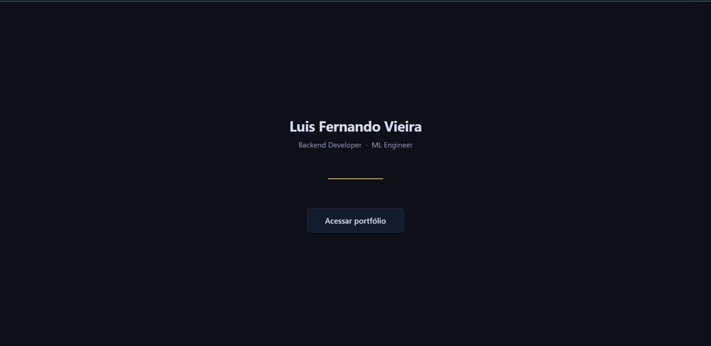
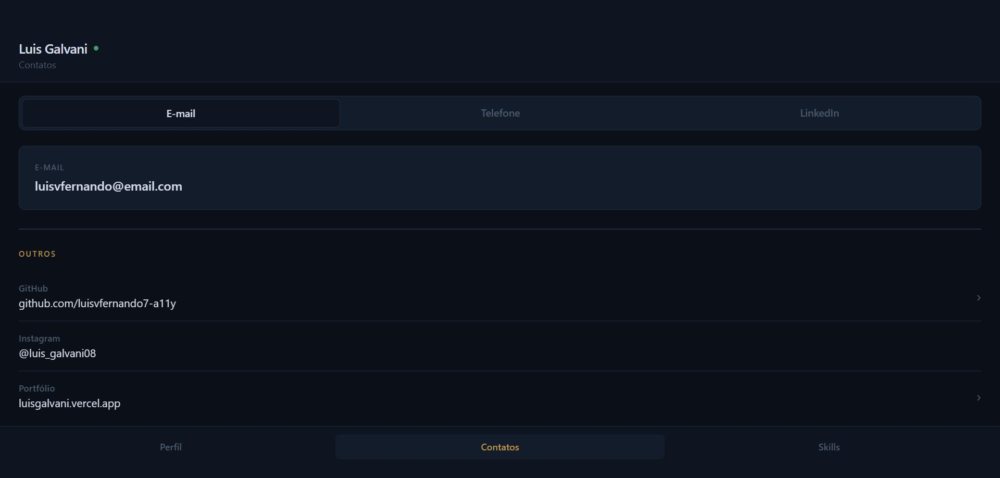
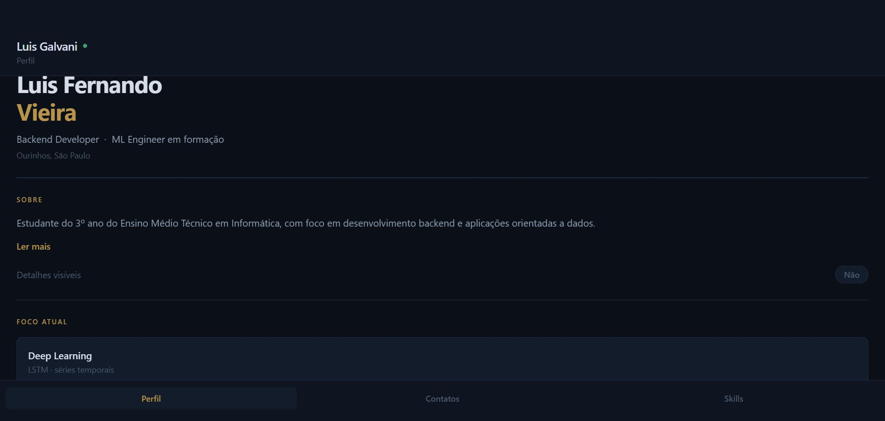
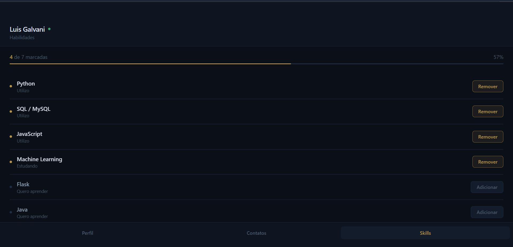

# Portfolio App (React Native)

Aplicativo de portfólio mobile desenvolvido com React Native e Expo, projetado para ser reutilizado como base por outros desenvolvedores.

---

## Visão Geral

Este projeto funciona como um template para criação de aplicativos de portfólio pessoal, permitindo customização rápida de informações como perfil, contatos e habilidades.

---
## Preview

### Home


### Contatos


### Perfil


### Skills


## Tecnologias

- React Native
- JavaScript
- Expo

---

## Estrutura do Projeto


.
├── assets/ # Imagens e ícones
├── components/ # Componentes reutilizáveis
├── App.js # Componente principal
├── index.js # Entry point
├── package.json # Dependências


---

## Requisitos

- Node.js instalado
- Git instalado
- Expo CLI (opcional)

---

## Instalação

Clone o repositório:

```bash
git clone https://github.com/luisvfernando7-a11y/portfolio-app.git

Acesse a pasta do projeto:

cd portfolio-app

Instale as dependências:

npm install

Se der erro no Windows por bloqueio de script:

npm.cmd install
Execução

Inicie o projeto:

npx expo start

Depois:

Escaneie o QR Code com o app Expo Go no celular
Ou use emulador Android/iOS
Customização

Você pode editar:

App.js → dados principais (nome, descrição)
components/ → layout e seções
assets/ → imagens e ícones
Contribuição

Este projeto foi criado para ser reutilizado. Sinta-se livre para:

Clonar
Modificar
Adaptar para seu próprio portfólio
Contato
Email: luisvfernando7@gmail.com
LinkedIn: https://www.linkedin.com/in/luisfernandovieira
GitHub: https://github.com/luisvfernando7-a11y
Licença

Uso livre para fins educacionais e pessoais.


Se isso quebrar no teu GitHub, o problema não é o README — é porque você não colocou as imagens na pasta `assets` com esses nomes (`home.png`, `contatos.png`, etc).